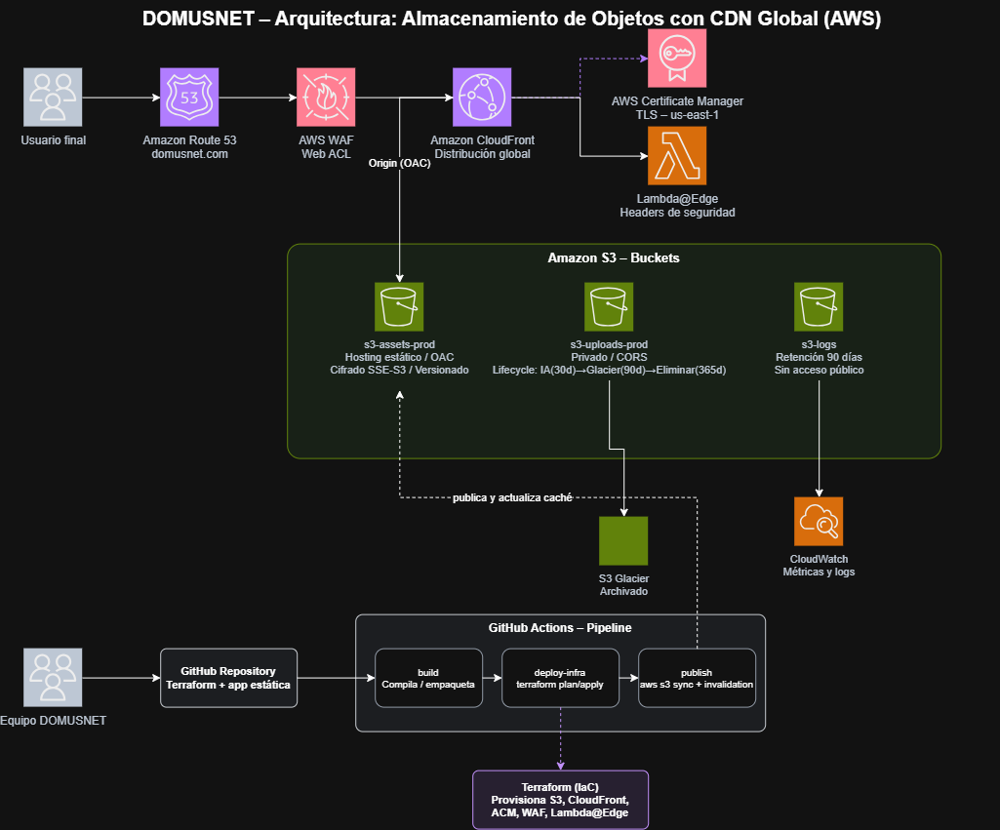

# 🌐 DOMUSNET — Plataforma de Almacenamiento de Objetos con CDN Global y Ciclo de Vida en AWS

> **Infraestructura para Ti** · Proyecto 04

Plataforma de hosting estático y distribución de activos digitales sobre **AWS**, desplegada 100 % como código con **Terraform** y automatizada con **GitHub Actions**. Combina almacenamiento durable en S3, distribución global con CloudFront, seguridad en el borde (WAF, ACM, Lambda@Edge) y optimización de costos mediante políticas de ciclo de vida.


---

## 📋 Tabla de contenidos

- [Descripción general](#-descripción-general)
- [Objetivos](#-objetivos)
- [Arquitectura](#-arquitectura)
- [Componentes](#-componentes)
- [Flujo de la solicitud](#-flujo-de-la-solicitud)
- [Pipeline CI/CD](#-pipeline-cicd)
- [Decisiones de diseño](#-decisiones-de-diseño)
- [Requisitos técnicos](#-requisitos-técnicos)
- [Estructura del repositorio](#-estructura-del-repositorio)
- [Plan de trabajo](#-plan-de-trabajo)
- [Entregables](#-entregables)
- [Riesgos y mitigación](#-riesgos-y-mitigación)
- [Equipo](#-equipo)

---

## 📖 Descripción general

| | |
|---|---|
| **Proyecto** | Plataforma de Almacenamiento de Objetos con CDN Global y Ciclo de Vida en AWS |
| **Plataforma cloud** | Amazon Web Services (AWS) |
| **Dificultad** | Intermedio |
| **Duración estimada** | 8 semanas |
| **Caso de uso** | Distribución de contenido estático y archivos de usuarios, con optimización de costos por ciclo de vida y hardening de seguridad en el borde |

La plataforma separa tres tipos de datos, cada uno en su propio bucket S3:

| Tipo de dato | Bucket | Acceso |
|---|---|---|
| Activos de la aplicación | `s3-assets-prod` | Servido públicamente **solo vía CDN** |
| Archivos subidos por usuarios | `s3-uploads-prod` | Privado, con ciclo de vida |
| Logs de acceso | `s3-logs` | Privado, retención de 90 días |

---

## 🎯 Objetivos

### General
Diseñar, construir y automatizar mediante Infraestructura como Código una plataforma de almacenamiento de objetos con distribución global de contenido en AWS, aplicando buenas prácticas de seguridad, optimización de costos y despliegue continuo.

### Específicos
- [ ] Configurar buckets S3 con mínimo privilegio, cifrado en reposo y versionado.
- [ ] Configurar CloudFront con **Origin Access Control (OAC)** para eliminar el acceso público directo al origen.
- [ ] Solicitar, validar y asociar certificados TLS con **ACM** para un dominio personalizado bajo HTTPS.
- [ ] Implementar ciclo de vida en S3: `Standard → Standard-IA → Glacier → eliminación`.
- [ ] Desarrollar y desplegar una función **Lambda@Edge** que inyecte cabeceras HTTP de seguridad.
- [ ] Construir un pipeline CI/CD que publique contenido e invalide la caché del CDN.
- [ ] Documentar arquitectura, costos y métricas de desempeño.

---

## 🏗️ Arquitectura

> 📌 Inserta aquí el diagrama exportado desde `DOMUSNET_Arquitectura.drawio`:
>
> ```markdown
> 
> ```

El diagrama editable (`DOMUSNET_Arquitectura.drawio`) es compatible con [diagrams.net](https://app.diagrams.net) y usa la librería oficial de íconos de AWS.

---

## 🧩 Componentes

| Componente | Función | Configuración clave |
|---|---|---|
| **Route 53** | DNS del dominio personalizado | Registro alias hacia CloudFront |
| **AWS WAF** | Filtrado de tráfico malicioso en el borde | Web ACL con reglas administradas de AWS (OWASP Top 10, rate limiting) |
| **CloudFront** | CDN global | Origen S3 vía OAC; TTL 86400 s para assets; sin caché para `index.html`; sin restricción geográfica |
| **ACM** | Certificado TLS | Región `us-east-1`, validación por DNS |
| **Lambda@Edge** | Hardening de cabeceras HTTP | Node.js, trigger `viewer-response`, desplegada vía Terraform (ZIP) |
| **S3 — assets** | Origen del hosting estático | OAC, cifrado SSE-S3, versionado, Block Public Access |
| **S3 — uploads** | Archivos de usuario | Privado, CORS, lifecycle: Standard → IA (30 d) → Glacier (90 d) → eliminación (365 d) |
| **S3 — logs** | Logs de CloudFront | Retención 90 días, sin acceso público |
| **Terraform** | Aprovisionamiento declarativo | Módulos por servicio, estado remoto, ejecutado desde el pipeline |
| **GitHub Actions** | CI/CD | Jobs `build → deploy-infra → publish` con invalidación de caché |
| **CloudWatch** | Observabilidad | Hit rate y latencia por región |

---

## 🔄 Flujo de la solicitud

1. El usuario resuelve `domusnet.com` en **Route 53**, que devuelve un alias hacia CloudFront.
2. La solicitud pasa por **AWS WAF**, que aplica reglas administradas antes de llegar a la distribución.
3. **CloudFront** responde desde el edge más cercano; si no hay caché, obtiene el objeto del origen vía **OAC** sin exponer el bucket.
4. **Lambda@Edge** (`viewer-response`) inyecta las cabeceras de seguridad:
   - `Strict-Transport-Security`
   - `X-Content-Type-Options`
   - `X-Frame-Options`
   - `Content-Security-Policy`
5. El certificado de **ACM** (`us-east-1`) garantiza que todo el tráfico viaje por HTTPS.
6. Los archivos de usuarios se guardan en `s3-uploads-prod` y transicionan automáticamente a clases más económicas.
7. Los logs de CloudFront llegan a `s3-logs` y alimentan métricas en **CloudWatch**.

---

## ⚙️ Pipeline CI/CD

Un `push` a la rama principal dispara el workflow de GitHub Actions con tres jobs encadenados:

```
build  ──►  deploy-infra  ──►  publish
```

| Job | Descripción |
|---|---|
| `build` | Compila y empaqueta la aplicación web estática |
| `deploy-infra` | Ejecuta `terraform plan` y `terraform apply` (S3, CloudFront, ACM, WAF, Lambda@Edge) |
| `publish` | Sincroniza con `s3-assets-prod` (`aws s3 sync`) e invalida la caché de CloudFront |

---

## 🧠 Decisiones de diseño

- **Buckets separados por tipo de dato:** evita que una política de acceso o de ciclo de vida afecte a otro caso de uso y facilita auditar permisos.
- **OAC en lugar de acceso público:** todo el tráfico pasa por CloudFront, centralizando caché, TLS y seguridad de borde.
- **Lambda@Edge en `viewer-response`:** garantiza que las cabeceras se apliquen tanto a respuestas cacheadas como a las del origen.
- **Ciclo de vida en 3 fases:** IA a los 30 días y Glacier a los 90 balancea costo con acceso ocasional.
- **Todo vía Terraform:** infraestructura versionada, revisable en pull requests y reproducible en otra cuenta o entorno.

---

## 🛠️ Requisitos técnicos

| Requisito | Detalle |
|---|---|
| **Cuenta AWS** | Permisos administrativos para IAM, S3, CloudFront, Lambda, ACM, Route 53 y WAF |
| **Dominio** | Dominio propio o subdominio delegado para pruebas |
| **Terraform** | CLI `>= 1.6`; backend remoto (S3 + DynamoDB para locking) |
| **Node.js** | Desarrollo y pruebas unitarias de Lambda@Edge |
| **GitHub** | Repositorio con secretos configurados para GitHub Actions |
| **Pruebas** | [securityheaders.com](https://securityheaders.com) y k6 / Apache Bench |

---

## 📁 Estructura del repositorio

> Estructura propuesta; ajústala a medida que avance la implementación.

```
.
├── .github/
│   └── workflows/
│       └── deploy.yml            # Pipeline: build → deploy-infra → publish
├── terraform/
│   ├── modules/
│   │   ├── s3/
│   │   ├── cloudfront/
│   │   ├── acm/
│   │   ├── waf/
│   │   └── lambda-edge/
│   ├── main.tf
│   ├── variables.tf
│   ├── outputs.tf
│   └── backend.tf
├── lambda-edge/
│   ├── index.js                  # Inyección de cabeceras de seguridad
│   └── tests/
├── app/                          # Aplicación web estática
├── docs/
│   ├── arquitectura.png
│   └── DOMUSNET_Arquitectura.drawio
└── README.md
```

---

## 🗓️ Plan de trabajo

| Sem. | Fase | Actividades principales | Responsable(s) | Entregable |
|:-:|---|---|---|---|
| 1 | Diseño y arranque | Arquitectura, diagrama, repo y backend remoto de Terraform | Todo el equipo | Propuesta + diagrama |
| 2 | S3 — fundamentos | Módulos Terraform, Block Public Access, SSE-S3, versionado | Diego | Buckets creados y documentados |
| 3 | S3 — ciclo de vida | Reglas de lifecycle (30/90/365 d) y CORS | Diego + Ellen | Lifecycle activo y validado |
| 4 | CloudFront | Distribución, OAC, cache policies | Jose | CloudFront sirviendo contenido de prueba |
| 5 | TLS y DNS | Certificado ACM, Route 53, asociación de WAF | Jose | Dominio propio con HTTPS válido |
| 6 | Lambda@Edge | Función de cabeceras, pruebas unitarias, despliegue vía Terraform | Jose + Sebastian | Función desplegada + reporte de securityheaders.com |
| 7 | Pipeline CI/CD | Workflow de GitHub Actions e invalidación de caché | Sebastian | Pipeline E2E funcional |
| 8 | Cierre y evaluación | Pruebas de rendimiento, análisis de costos, métricas, documentación | Ellen + equipo | Informe final y presentación |

---

## 📦 Entregables

| Entrega | Contenido |
|---|---|
| **Entrega 1** ✅ | Propuesta de proyecto, diagrama de arquitectura (imagen + `.drawio`), roles y plan semanal |
| **Entrega 2** | Código Terraform de S3 (buckets, políticas, cifrado, versionado, lifecycle) y evidencias |
| **Entrega 3** | Terraform de CloudFront, ACM, Route 53 y WAF; Lambda@Edge con pruebas; sitio por HTTPS en dominio propio |
| **Entrega final** | Pipeline completo, análisis de costos (Standard vs IA vs Glacier), reporte de cabeceras de seguridad, métricas de CloudFront y presentación |

### Criterios de evaluación

| Criterio | Peso |
|---|:-:|
| S3: políticas correctas, cifrado y versionado | 20 % |
| CloudFront con OAC, TLS y dominio personalizado | 25 % |
| Lifecycle policies implementadas y documentadas | 15 % |
| Lambda@Edge con headers de seguridad correctos | 20 % |
| Pipeline de publicación automática | 15 % |
| Análisis de costos y documentación | 5 % |

---

## ⚠️ Riesgos y mitigación

| Riesgo | Impacto | Mitigación |
|---|:-:|---|
| Costos inesperados en AWS | Medio | AWS Budgets y alarmas; revisión semanal; capa gratuita |
| Certificado ACM fuera de `us-east-1` | Alto | Checklist de despliegue y región fija en el módulo Terraform |
| Pérdida de datos por errores de lifecycle | Alto | Pruebas en staging; versionado activo como red de seguridad |
| Dependencia de un solo integrante | Medio | Revisiones cruzadas, documentación continua, pair-programming |
| Retrasos en validación de dominio/DNS | Medio | Iniciar certificado y DNS en la semana 1 |

---

## 👥 Equipo

**DOMUSNET** — 4 integrantes. Las decisiones de diseño se validan en revisiones semanales y todo el código se integra mediante pull requests revisados por al menos un compañero distinto al autor.

| Integrante | Rol | Componentes a cargo |
|---|---|---|
| **Diego Rosales** | Cloud & IaC | S3 (buckets, políticas, lifecycle), estructura del repositorio Terraform |
| **Sebastian Torres** | DevOps / CI-CD | GitHub Actions, sincronización S3, invalidación de caché |
| **Jose Chima** | Seguridad Cloud | CloudFront, ACM, WAF, Lambda@Edge, cabeceras HTTP |
| **Ellen Ordoñez** | QA, Costos y Documentación | CloudWatch, securityheaders.com, informes y documentación |

---

## 🚀 Uso rápido

```bash
# 1. Clonar el repositorio
git clone https://github.com/ISCOUTB/Plataforma-de-Almacenamiento-de-Objetos-con-CDN-Global-y-Ciclo-de-Vida-en-AWS.git
cd <nombre-del-repo>/terraform

# 2. Inicializar Terraform con el backend remoto
terraform init

# 3. Revisar y aplicar los cambios
terraform plan
terraform apply
```

> En el flujo normal, el despliegue se realiza automáticamente al hacer `push` a la rama principal mediante GitHub Actions.

---

<p align="center"><b>DOMUSNET</b> · Infraestructura para Ti</p>
